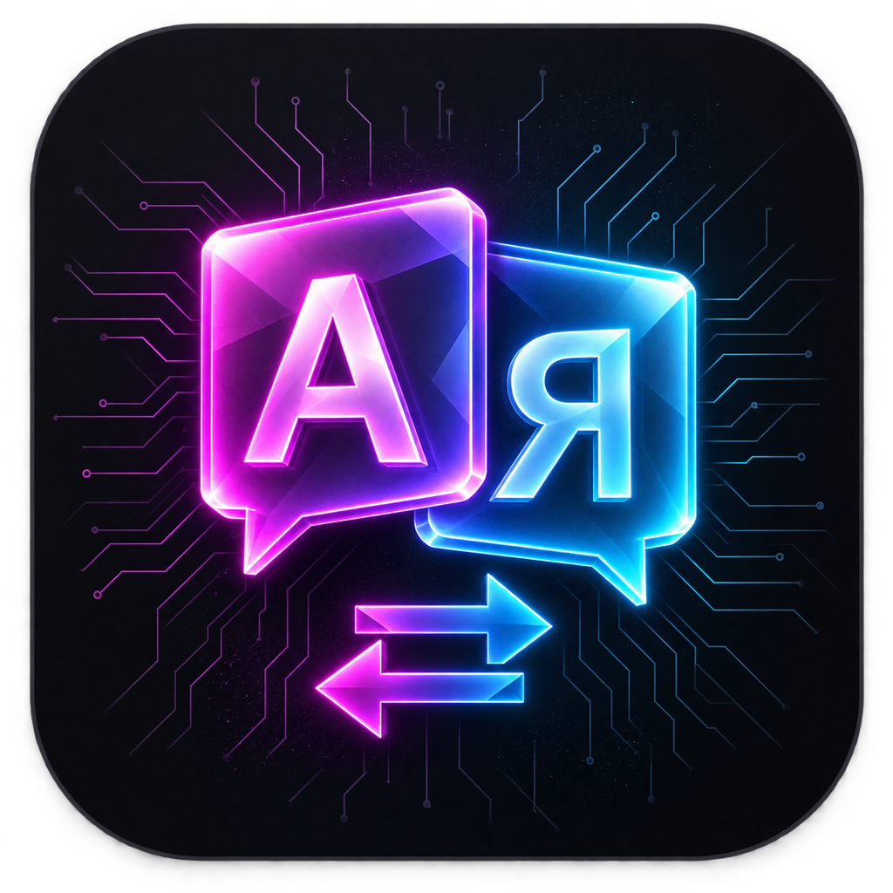
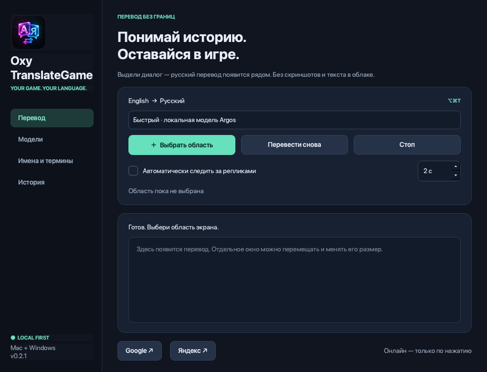
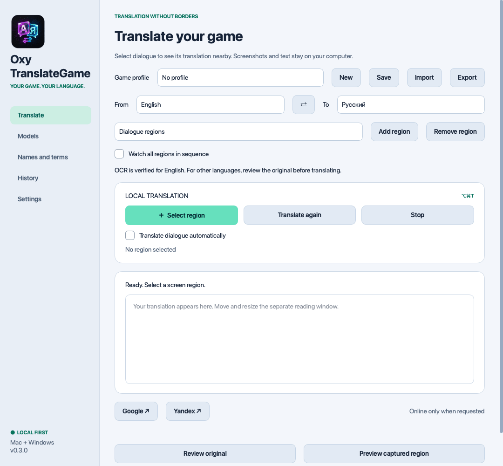

<p align="center">
  
</p>

# OxyTranslateGame

**Translate a game region. Keep reading the story.**

A local-first desktop app for **macOS and Windows**, with a System/Russian/English interface and selectable translation languages. Select dialogue, get a floating translation, or watch a subtitle region automatically.

[**Download ready-to-run apps**](https://github.com/Datastore24Kirill/OxyTranslateGame/releases) · [Русская инструкция](README.ru.md) · [MIT license](LICENSE)

No source build, Python installation, subscription, or API key is needed for release downloads. The Windows release includes a normal per-user `.exe` installer and a portable ZIP. Mac releases are `.app` bundles inside ZIP files; move the app to Applications.



## Version 0.3 preview

- Live System / Russian / English UI, complete light/dark/system palettes, UI scaling and keyboard-accessible controls.
- Independent source/target languages, swap, conservative automatic detection, and a catalog of available direct Argos pairs. Translation language selection does **not** imply verified OCR for every alphabet.
- Fast Argos, literary Ollama and literal Ollama modes. Local context of three passages and a glossary guide Ollama; output can still be wrong.
- Game profiles with languages, mode, model, glossary, regions, theme, reader font/opacity and shortcuts; JSON import/export.
- Up to eight saved regions, sequential monitoring, optional window attachment/resizing and pause while the attached window is minimized.
- Reader click-through, compact mode, original text, font/opacity and recovery through the tray menu.
- Searchable, bounded history, CSV export and optional local persistence (off by default). Translation context remains available even with history disabled.
- Model download progress/cancel/retry/removal, OCR enlargement/contrast, editable OCR result and an in-memory capture preview.
- Configurable global shortcuts, economy mode, OCR/total latency, stale-result cancellation, a first-run guide and opt-in diagnostic export.
- Stable/preview update channel and release notes before installation. Previous installation retained for recovery.

[Full feature guide and limits](docs/features-0.3.md) · [Download releases](https://github.com/Datastore24Kirill/OxyTranslateGame/releases)



## Start

1. Download the appropriate app from **Releases**, unzip/install, and open it. Requirements: macOS 14+ or Windows 10/11 x64. Choose the Mac build matching your processor when multiple builds are provided.
2. On Mac, allow **Screen Recording** for the app. Accessibility permission is not required. After an ad-hoc signed update, macOS may require removing the old permission entry and granting it again.
3. Select source/target languages, then open **Models → Download offline model** once. Internet is needed for the download, not for later translation.
4. Press **⌥⌘T** on Mac / **Ctrl+Alt+T** on Windows, or click **Выбрать область**, then drag around dialogue. Esc cancels selection.
5. The result opens in a floating reading window. Select **Автоматически следить за репликами** for updates. Use Attach region to window to follow window movement/resizing on the same display; reselect after changing monitors. Attachment is per session.
6. Closing the reading window stops monitoring. Closing the main window stops work and keeps the tray/menu-bar app available. Use its Exit action to quit.

### Literary mode

Install [Ollama](https://ollama.com/download) and run it. In the app's **Модели** page, select a local model and click **Скачать выбранную модель**. Choose **Literary** in Settings. Larger models need more RAM/VRAM and can be slow alongside a game. Start with 4B; do not assume that every machine can run 8B comfortably.

In **Имена и термины**, enter one mapping per line, such as `Mrs. Smith = миссис Смит`. Save explicitly. The glossary guides the literary model; the fast engine does not apply it. The model can still make errors, so the original remains available.

## Privacy

Screenshots and dialogue stay in memory by default. History is saved locally only when Save history to disk is enabled; disabling it removes that history file. Profiles and saved glossaries are local. CSV/profile exports and diagnostic files are written only on request. Diagnostic ZIPs exclude game text and images unless their respective checkboxes are explicitly selected.

Fast translation runs in-process. Literary mode connects **only to `127.0.0.1:11434`**, bypasses proxy environment variables, and rejects cloud model tags. An independently configured Ollama installation is outside the app's control. Model installation downloads files from the Argos index / model host or through Ollama. Nothing is uploaded by these download actions.

Google/Yandex buttons explicitly ask before opening the recognized text in their websites. The text then leaves the computer and may enter browser history; the screenshot is not sent. These buttons are optional and separate from automatic local translation. Official Google Cloud and Yandex APIs have billing/limits and are not presented as unlimited free services.

## Limitations

OCR in this release is optimized for English source text. Small, stylized or animated text may be misread. Screen capture can fail for protected content or some exclusive-fullscreen games; try borderless/windowed mode. One selection is limited to a single monitor. The reading window briefly hides during capture so it cannot capture its own translation. Stop/cancel invalidates pending results; a running native inference/network operation may need to finish before another begins.

Preview binaries are not notarized by Apple or Authenticode-signed on Windows. OS warnings are therefore possible. Open only builds you trust; do not disable OS security globally. Packaging checks and simulated UI tests do not replace real hardware/game compatibility testing.

## For contributors (not required for users)

The cross-platform application is in `desktop/`. Use Python 3.12:

```sh
python -m venv .venv
# activate it using your platform's usual command
python -m pip install -r desktop/requirements.txt
python -m unittest discover -s desktop/tests -v
python desktop/app.py
python desktop/build.py
```

Windows installer: compile `desktop/installer.iss` with Inno Setup 6 after the PyInstaller build. GitHub Actions packages both systems and uploads ready-to-run build artifacts. Release assets are linked above.

The original macOS-only Apple Translation implementation remains in `Sources/` for reference and development (`swift test`, `scripts/build-app.sh`). Its requirements differ (macOS 15+) and it is not the cross-platform release.

See [CONTRIBUTING.md](CONTRIBUTING.md) and [third-party notices](desktop/THIRD_PARTY.md).

## Updates

Release checks run at startup and every six hours. Manual check, Later, Skip version and an automatic-check toggle are available. Click Update to download the matching archive, verify its SHA-256 digest from GitHub, replace the installed app and restart. A confirmation with release notes is shown first; the previous application is retained beside the installation for recovery. A failed file replacement restores the previous installation; a crash after a successful launch is not automatically detected. Models and settings remain in their data folder. Only public release metadata is requested, never screenshots or dialogue. Stable releases are the default channel; enable Include preview releases explicitly to see previews. Ad-hoc macOS builds may need Screen Recording permission granted again after replacement; a stable Developer ID signature is needed for durable public-release identity.

### Оформление и доступ к экрану

В разделе **Настройки** находятся тема (системная, светлая или тёмная), режим перевода, интервал слежения и обновления. Выбор сохраняется автоматически и применяется также к окну перевода.

На macOS здесь показан фактический статус разрешения записи экрана. При подтверждённом доступе доступна кнопка **Выбрать область**. Если после обновления переключатель включён, а доступ не подтверждён даже после перезапуска, раскройте **Доступ включён, но не работает** и нажмите **Сбросить старое разрешение…**. После подтверждения будет сброшено только разрешение OxyTranslateGame; приложение перезапустится и вызовет новый запрос macOS. Подтвердите его и выполните перезапуск, если macOS потребует. Обычная проверка ничего не сбрасывает.

Текущие Mac-сборки подписаны временной подписью: разрешение может потребоваться заново после обновления. Для сохранения идентичности между публичными релизами необходима постоянная подпись Developer ID.

### Code signing policy

See the [code signing policy](docs/code-signing.md) and [privacy policy](docs/privacy.md). SignPath Foundation declined our application on 2026-10-06 because the project has not yet established sufficient public visibility. Windows builds remain unsigned; a future application is possible after broader adoption.
